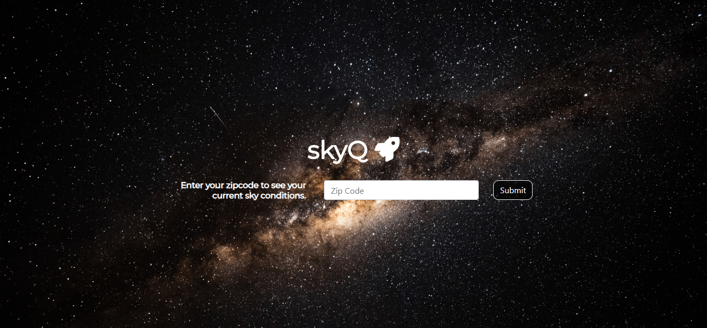

# skyQ

> An amateur stargazer’s quick source for celestial information, skyQ is a guide to objects that are typically visible from Earth in an easy-to-digest format.

## Table of Contents

* [Overview](#overview)
* [Features](#features)
* [Technologies](#technologies)
* [Contributing](#contributing)
* [Authors](#authors)
* [License](#license)

## Overview

The skyQ project was the first project created as part of the Full Stack Coding Bootcamp at UT Austin. The purpose of the project was to go from idea, to MVP, to polished and presentable product within the 7 days. The aim was to learn to work as part of a dev team while demonstrating proficiency in HTML, CSS, Javascript, AJAX, Git, Github and using best practices.

You can access the website here --> [skyQ](https://dezrogers.github.io/skyQ/)

## Features

* Browser-based planetarium based on the location submitted by the user
* Interactive 3D Globe that also displays the current location of the International Space Station
* Weather forecast

## Technologies

* HTML/CSS
* Bootstrap 4
* Firebase
* [WebGL Earth](https://www.webglearth.com/) API - _3D Globe_
* [ISS API](https://wheretheiss.at/) API - _ISS Tracker_
* [VirtualSky](https://virtualsky.lco.global/) API - _Planetarium_
* [Openweathermap](https://openweathermap.org/) API - _Weather Forecast_

## Contributing

See [Contributing](https://dezrogers.github.io/skyQ/docs/CONTRIBUTING.md)

## Authors

Developers on this project can be found on the [Contributors](https://dezrogers.github.io/skyQ/graphs/contributors) page of this repo.

## License

This project is licensed under the MIT License - see the [LICENSE](LICENSE) file for details.
